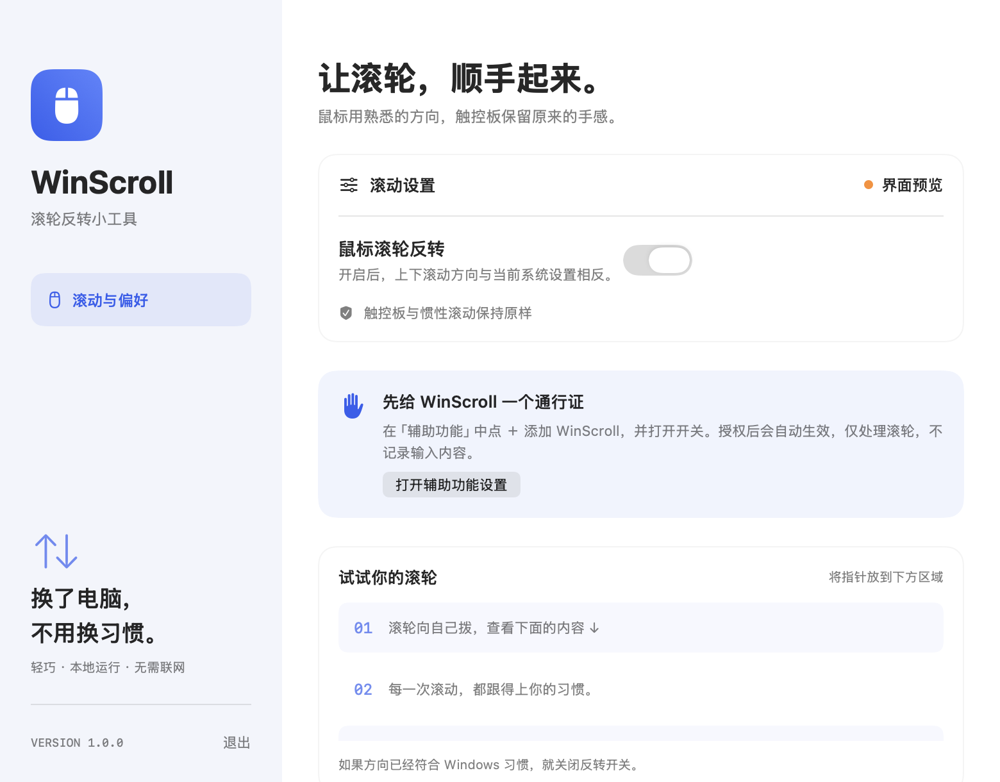

# WinScroll · 滚轮反转

让 Mac 鼠标中间滚轮用回熟悉的 Windows 滚动方向。原生 Swift / SwiftUI 菜单栏小工具，本地运行，无联网、无统计、无第三方运行依赖。

**macOS 13+ · Apple Silicon · Swift / SwiftUI · MIT 开源**



## 下载

在 **[版本下载页面](https://github.com/ZhuMeng749/WinScroll/releases/tag/v1.0.1)** 下载 `WinScroll-1.0.1-macOS-arm64.zip`，解压后即可获得应用，无需自己编译。Intel Mac 暂未提供预编译包。

当前版本是 **1.0.1 修复预览版**，已完成编译与 34 项逻辑检查，并在普通蓝牙鼠标上确认滚轮方向恢复正常。更多设备兼容性仍需要反馈。

应用使用本地 ad-hoc 签名，**尚未经过 Apple 公证**，首次打开可能会被 macOS 拦截。请先核对项目来源；如决定使用，可按 [Apple 官方说明](https://support.apple.com/102445) 在「系统设置 → 隐私与安全性」允许打开此应用。

## 使用

1. 将解压得到的 `WinScroll.app` 拖入「应用程序」文件夹，再双击打开。
2. 首次打开会出现设置与滚动测试窗口。点击「打开辅助功能设置」，在系统设置的辅助功能列表中添加 `/Applications/WinScroll.app`，打开开关。应用每两秒检测权限，授权后自动生效。
3. 保持「鼠标滚轮反转」开启，在测试区尝试中间滚轮：向自己拨动时，应查看页面下面的内容。
4. 关闭设置窗口，应用继续在顶部菜单栏运行。点击菜单栏上下箭头图标，可暂停、恢复、设置开机启动或退出。

应用会反转**当前**滚轮方向。一般配合 macOS「自然滚动」开启使用；如果系统已经关闭自然滚动且方向符合 Windows 习惯，关闭本应用的反转开关即可。应用不修改系统的自然滚动设置。

## 第一版功能

- 普通鼠标中间滚轮的垂直方向反转；不改变指针、鼠标按键或横向滚动。
- 保留连续滚动、触控板手势与惯性事件。
- 菜单栏常驻，一键暂停，设置自动保存。
- macOS 原生登录项管理；开机启动默认关闭，由用户手动开启。
- 中文权限引导、服务状态和真实滚动测试区域。
- 同步底层滚轮数据；实时显示收到、反转和完整同步的次数。
- 明确提示开关开启但尚未授权、安装位置不固定及其他滚轮工具同时运行的情况。
- 事件监听超时后重新启用；暂停和退出时释放监听。

## 兼容范围

最低 macOS 13。构建脚本为当前电脑架构生成应用；当前发布的下载包为 Apple Silicon（arm64）。

第一版根据公开 CoreGraphics 滚轮字段区分普通滚轮和连续滚动。这是保守的启发式判断，**不是完整 HID 设备识别**：Magic Mouse、第三方平滑滚动驱动或部分高精度鼠标可能不反转。如果同时运行其他滚轮修改软件，请先暂停其中一个，避免方向被反转两次。

触控板“保持原样”指保留现有系统行为，不会自动改变触控板的系统设置。

## 构建与验证

安装 Apple Command Line Tools 或 Xcode 后：

```sh
bash scripts/test.sh
bash scripts/build.sh
```

输出：

- `dist/WinScroll.app`
- `dist/WinScroll-macOS.zip`

项目附带 `Package.swift`，可用 Xcode 打开进行开发。完整的 Xcode / Swift 工具链也可以执行 `swift test`。独立脚本直接调用 Apple 编译器，不依赖 Swift Package Manager 或 XCTest。

本地构建默认使用 ad-hoc 签名。计划分发经过 Apple 公证的版本时，需配置自己的 Developer ID、稳定 bundle ID，并完成公证。可通过 `WINSCROLL_SIGN_IDENTITY` 指定签名身份。更换签名或重新构建后，系统可能要求重新添加辅助功能授权。

### 手动验收

- 首次启动：显示权限引导，没有权限时不显示“反转中”。
- 授权后：菜单栏状态变为“鼠标滚轮反转中”。
- 普通鼠标：浏览器、Finder 和测试区上下滚动符合预期。
- 触控板：双指滚动和惯性方向不变。
- 关闭反转：立即恢复原始方向；重开应用后保持选择。
- 开机启动：放入「应用程序」后开启，在系统登录项中确认并重登测试。
- 退出：菜单栏消失，滚动恢复原始方向。

自动测试覆盖事件变换；真实设备滚动、系统权限与重新登录需要在目标 Mac 手动验证。`--preview` 启动参数只预览界面，不安装全局滚动过滤器，不允许设置登录项。

## 开源参考

详见 [REFERENCES.md](REFERENCES.md)。本项目独立实现第一版功能，没有打包其他项目的源码、二进制或图标。

## License

MIT，见 [LICENSE](LICENSE)。

## 反馈与贡献

欢迎提交 Issue 或 Pull Request。反馈滚动问题时，请附上 macOS 版本、鼠标型号、系统自然滚动是否开启，以及是否同时运行其他鼠标驱动。请勿附上密码、令牌或其他私人信息。
